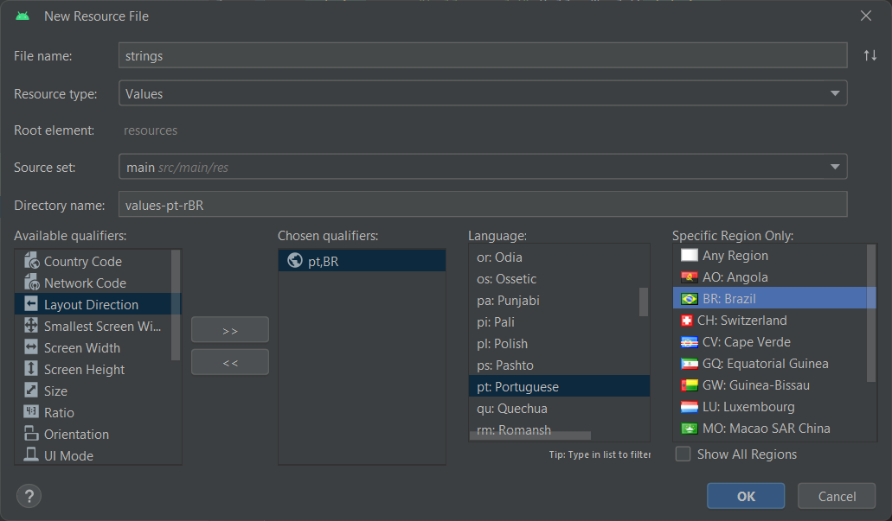

# Coil

[Multmidia Picker in Jetpack Compose (Medium)](https://medium.com/@yogesh_shinde/implementing-image-video-documents-picker-in-jetpack-compose-73ef846cfffb)

```
# build.gradle.kts

dependencies {
    implementation("io.coil-kt:coil-compose:2.6.0")
}
```

# Internacionalização
* res/values/strings.xml:
```
<resources>
    <string name="app_name">MediaPickerSuite</string>
    <string name="hello_world">Hello World!</string>
</resources>
```
* res -> new -> Android Resource File


* res/values_pr_rBR/strings.xml:
```
<?xml version="1.0" encoding="utf-8"?>
<resources>
    <string name="app_name">MediaPickerSuite</string>
    <string name="hello_world">Olá Mundo!</string>
</resources>
```